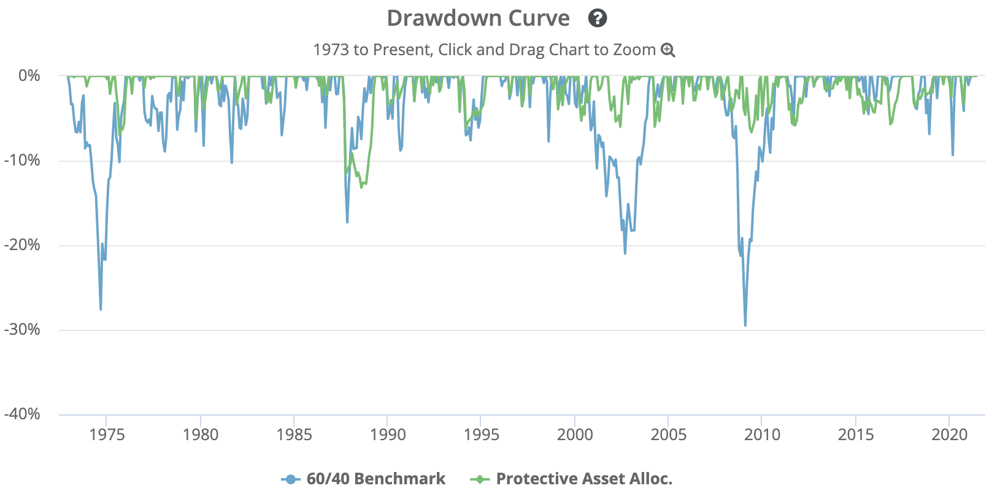

```{r setup, include=FALSE, warning=FALSE, message=FALSE}
knitr::opts_chunk$set(echo = FALSE, 
                      messages = FALSE, 
                      warning = FALSE,
                      cache = TRUE)
library(tidyverse)
library(stringr)
library(htmltools)
library(knitr)
library(tidyquant)
library(timetk)
library(PerformanceAnalytics)
library(xts)
library(data.table)
library(kableExtra)
library(gridExtra)
```

```{css, echo=FALSE}
#header {
  border-left: 3px solid #486370;
  padding-left: 10px;
}

h1 {
  color: #486370;
  font-weight: 500;
  border-left: 3px solid #486370;
  padding-left: 10px;
  margin-top: 110px;
}

#header h1 {
  border: none;
  padding-left: 0;
}

h2 {
  color: #512D6D;
  font-weight: 600;
}

h3 {
  color: #512D6D;
  font-style: italic;
  font-weight: 600;
}

h4 {
  color: #512D6D;
  font-weight: 600;
}
```

```{r, echo=FALSE}

# LYNXX LOGO

# modify css chunk above for additional font/spacing modifications
# fix the URL path or modify to lead to your locally saved logo - the image will be embedded into the document

htmltools::img(src = knitr::image_uri(here::here("analysis/lynxx_logo.png")), 
               alt = 'Lynxx logo', 
               style = 'position:absolute; top:0; padding:20px; border-left: 3px solid #486370; max-width:20%;margin-top:25px')

```

# Introduction 
Nowadays investors would search for less risky investment, which means a low risk and absolute return portfolio. In this paper we describe a simple dual-momentum model (called Protective Asset Allocation or PAA) with a protection for our assets. It is a tactical variation on the traditional 60/40 stock/bond portfolio where the optimal stock/bond mix is determined by multi-market breadth using dual momentum. We test the model with 12 global random assets starting within recent 4 years starting from 2017-05-01 to 2021-04-01. The PAA strategy satisfy our absolute return requirement without compromising high returns with low risks at the same time, this makes PAA an appealing alternative for a 1-year term deposit. 

# The PAA Model
In this paper we will combine protective momentum with a simple dual momentum model, based on SMA (Simple Moving Average), to arrive at the **Protective Asset Allocation (PAA)** strategy. Faber showed how an SMA filter of asset prices can improve not only the risk but also the returns, which is moving to cash for as long as the most recent price (P0) is below the SMA trend, which is often based on the average of the last 10 (SMA10) or 12 monthly prices (SMA12) [@Faber2007]. 

The mechanism behind trend following is that of “momentum” or “price persistence” where rising prices will continue to rise and falling prices will get even lower [@Keller2016]. In this case momentum is compared between assets, often using the return over say the last twelve months. Next the assets with the highest relative returns (e.g. the best Top6 assets out of a universe with 12 assets) are selected for investment. This explains the relative momentum. However, each month different assets may show up in the Top selection, one “rotates” these assets over the months depending on their relative momentum, assuming monthly portfolio reformations. Therefore, absolute momentum often implies the application of a trend filter overlay (e.g.using Simple Moving Average SMA12) while replacing assets by cash when the trend is negative. Relative momentum implies choosing the Top performing assets (in terms of e.g. a 12-month return) out of the total assets in the universe. 

Our momentum model is a combination of absolute and relative momentum which were based on the 12-month return, based on an SMA12 trend. In addition, we will use a protection by moving all capital to "cash" like safe treasury bonds when global markets becomes more bearish, which is called Protective Momentum. Therefore, we will combine protective momentum with simple momentum, based on SMA, to arrive at the Protective Asset Allocation (PAA) strategy. We will distinguish between **low (PAA0), medium (PAA1) and high protection strategies (PAA2)**, depending on the chosen protection rate (a=0,1,2, resp.). 

The multi-market breadth indicator we used to measure the market regime globally for Protective Momentum could improve risk adjusted returns. It is based on the idea that crash-protection by trend following can also be applied to the universe instead of to individual assets. In other words, due to correlation among assets, not only an asset’s own momentum but also the momentum of other assets in the universe could provide useful information for the required amount of crash-protection [@Keller2016].

Here is the 12 assets that we will use in our universe to analyze the PAA model. All data is from free sources (Yahoo Finance), and consists of end-of-month adjusted (total return) prices (adjusted for dividends, splits, etc.), excluding dividend taxes (gross). To illustrate, consider a strategy that goes long asset X when asset X closes above its 200-day moving average (MA). To truly capture what the 200-day MA is intended to capture (i.e. the average value of asset X over the last 200 days), we should use dividend-adjusted data. In this case, an N=12 universe with a 6-asset rotation based on momentum, we can move 100% to cash when all top6 assets have positive momentum and all other six assets have non-positive momentum according to our most protective momentum approach (PAA2). Therefore our protective momentum can be much more aggressive in moving to cash. This turns out to be not only good for risk reduction but even for returns. Here “limit your losses” helps to reduce risk and even to improve returns (relative to the 60/40 benchmark), as we hope to demonstrate in this paper.

```{r message=FALSE}
BEPTF <- read_csv(here::here("data/BEPTF.csv")) %>%
  select(Date, `Adj Close`) %>%
  rename(BEPTF = `Adj Close`)
DXCM <- read_csv(here::here("data/DXCM.csv")) %>%
  select(Date, `Adj Close`) %>%
  rename(DXCM = `Adj Close`)
FB <- read_csv(here::here("data/FB.csv")) %>%
  select(Date, `Adj Close`) %>%
  rename(FB = `Adj Close`)
FIVN <- read_csv(here::here("data/FIVN.csv")) %>%
  select(Date, `Adj Close`) %>%
  rename(FIVN = `Adj Close`)
FSLR <- read_csv(here::here("data/FSLR.csv")) %>%
  select(Date, `Adj Close`) %>%
  rename(FSLR = `Adj Close`)
FTV <- read_csv(here::here("data/FTV.csv")) %>%
  select(Date, `Adj Close`) %>%
  rename(FTV = `Adj Close`)
NFLX <- read_csv(here::here("data/NFLX.csv")) %>%
  select(Date, `Adj Close`) %>%
  rename(NFLX = `Adj Close`)
OSTK <- read_csv(here::here("data/OSTK.csv")) %>%
  select(Date, `Adj Close`) %>%
  rename(OSTK = `Adj Close`)
RUN <- read_csv(here::here("data/RUN.csv")) %>%
  select(Date, `Adj Close`) %>%
  rename(RUN = `Adj Close`)
SONY <- read_csv(here::here("data/SONY.csv")) %>%
  select(Date, `Adj Close`) %>%
  rename(SONY = `Adj Close`)
SWKS <- read_csv(here::here("data/SWKS.csv")) %>%
  select(Date, `Adj Close`) %>%
  rename(SWKS = `Adj Close`)
TXRH <- read_csv(here::here("data/TXRH.csv")) %>%
  select(Date, `Adj Close`) %>%
  rename(TXRH = `Adj Close`)

Portfolio <- BEPTF %>%
  left_join(DXCM, by = "Date") %>%
  left_join(FB, by = "Date") %>%
  left_join(FIVN, by = "Date") %>%
  left_join(FSLR, by = "Date") %>%
  left_join(FTV, by = "Date") %>%
  left_join(NFLX, by = "Date") %>%
  left_join(OSTK, by = "Date") %>%
  left_join(RUN, by = "Date") %>%
  left_join(SONY, by = "Date") %>%
  left_join(SWKS, by = "Date") %>%
  left_join(TXRH, by = "Date") %>%
  tail(-12) 
Portfolio
```

## Momentum indicator
The SMA filter signals a positive trend when the latest price is above the SMAx level, where x is the number of past prices which are averaged. The dual-SMA-momentum approach is the basis of our Protective Asset Allocation (PAA) model, together with a vigorous crash protection where the bond fraction is increased in bear markets using a multi- market breadth indicator, our momentum indicator is based on the **SMA(L)** filter and the **most recent asset price p0**. 

The SMA filter signals a positive trend when the latest price p0 is above the SMA(L) level. Since we will be using monthly data as the table shown above, the lookback L always refers to L months, the SMA(12) in the table below is based on a linearly decreasing weight filter over the previous 12-monthly returns. 

Our momentum indicator is: **MOM(L) = p0/SMA(L) - 1**. 

We will use a global multi-market universe as a replacement for stocks in the traditional 60/40 stock/bond mix, therefore our universe will focus on “risky” assets, like the stocks in the 60/40 mix but now with an active mix instead of a fixed 60/40 allocation (and global assets classes instead of stocks).

```{r message=FALSE}
P0 <- Portfolio %>%
  filter(Date == "2021-04-01") %>%
  pivot_longer(cols = c("BEPTF":"TXRH"),
               names_to = "Asset",
               values_to = "P0") %>%
  select(-Date) 
MOM <- Portfolio %>%
  filter(Date == c("2020-05-01", "2020-06-01","2020-07-01", "2020-08-01", "2020-09-01","2020-10-01","2020-11-01","2020-12-01","2021-01-01","2021-02-01","2021-03-01","2021-04-01")) %>%
  pivot_longer(cols = c("BEPTF":"TXRH"),
               names_to = "Asset",
               values_to = "Price") %>%
  group_by(Asset) %>%
  summarise(SMA12 = mean(Price)) %>%
  left_join(P0, by = "Asset") %>%
  mutate(MOM12 = P0/SMA12-1) %>%
  arrange(-MOM12)
kable(MOM, caption = "") %>%
  kable_styling(bootstrap_options = c("striped", "hover")) 
```

Before disclosing the PAA recipe we have to define “good” and “bad” assets. There are n good assets with a **positive momentum**, so MOM(L) > 0, n<=N. The remaining (N-n) assets (with MOM<=0) are the bad assets. We will simply use the number of good/bad assets as a regime indicator: more bearish when n is low, more bullish when n is high relative to N. This indicator applied to stocks is often called the “breadth” of the market. Since we apply it to assets, we will call it the “multi-market breadth” indicator. 

From the table calculated above, we could find that there are **9 good assets** with *positive momentum*, and **3 bad assets** with *negative momentum* in our 12 assets universe, which means n = 9 while N = 12. 

## Bond Fraction
The optimal mix of “risky” assets will be determined by the dual momentum model. The optimal **Bond Fraction (BF)** is determined by the market regime which is measured by the multi-market breadth. So BF will therefore determine the balance between the risky and the bond (IEF) part of our capital allocation, with monthly reformations.

Having defined all necessary ingredients, we are now able to give the recipe for our PAA model:

- Compute the *bond fraction* BF depending on the number of good assets n:
**BF = (N-n)/(N-n1)**, with **n1 = a*N/4** where a is the protection factor (a>=0) and BF=100% if n<=n1.

- Determine the **Top (Top<=N)** good assets with the *highest momentum* to form the risky (stock-
like) part of the portfolio with *equal weights (EW)* for each risky asset. If n<Top, only the n good
assets (with positive momentum) will be included in this risky **Equal Weight (EW)** portfolio.

- Mix the risky EW portfolio with the bond part in a (1-BF)/BF fashion, like with the 60/40 strategy.

Notice that the higher the protection factor a is, the higher is n1 (with BF=100% if n<=n1) and therefore by increasing a, the bond fraction BF will become higher for the same number of good assets n. Notice also that our portfolio is long-only, and equal-weight, except for the bond part (which fraction is determined by the equation above).

The **low-protective PAA model** arises when the protection factor is set to **a=0**. Then the bond fraction BF equals the fraction of bad assets in the full (risky) universe, i.e. BF=(N-n)/N. So with e.g. n=6 and N=12, the bond fraction becomes BF=50%. Only when all assets are bad (n=0) the bond fraction becomes 100%. We will call this the low-protection PAA model, denoted by PAA0. 

When the protection factor is dialed up to **a=1**, the bond fraction BF equals the fraction of bad assets relative to three-quarters of size of the risky universe (so 0.75N), i.e. BF=(N-n)/(0.75N), with a maximum of 100%. So with e.g. n=6 and N=12, the bond fraction becomes BF=6/9=67%. This also implies that with 75% or more bad assets in the universe, the bond fraction becomes 100%. We will call this the medium- protection PAA model, denoted by PAA1.

The **most protective PAA model** is obtained with the protection factor set to **a=2**. Then the bond fraction BF equals the fraction of bad assets relative to half of size of the risky universe (so 0.5N), i.e. BF=(N- n)/(0.5N), with a maximum of 100%. This also implies that with 50% or more bad assets in the universe, the bond fraction becomes 100%. So with again e.g. n<=6 and N=12, allocation of 100% of capital will go to our safe haven fund since BF=100%. We will call this the high-protective PAA model, denoted by PAA2. 

```{r message=FALSE}
protection_factor <-c("a=0", "a=1", "a=2")
n1 <- c(0,3,6)
BF <- c("25.00%", "33.33%", "50.00%")
BF <- tibble(protection_factor, n1, BF)
kable(BF, caption = "Bond Fraction") %>%
  kable_styling(bootstrap_options = c("striped", "hover")) 
```

In this case, the bond fraction BF soon becomes very dominant when the high-protective (a=2) model is applied, where 9 (out of N=12) good assets the bond coverage is already 50% as the table presented above. Therefore we determine the Top good assets to form the risky part of the portfolio with equal weights for each risky asset for 50%. 

## The best scenarios
In order to compare the scenarios based on top assets, we will need performance measures. We will look at all the usual performance measures like return **R (CAGR), V (Volatility), D (max Drawdown), SR (Sharpe Ratio above the risk-free return) and MAR (=R/D)**.

- **Return**: The average monthly return earned by the portfolio over the period tested. 

- **Volatility**: Volatility is often measured as either the standard deviation or variance between returns from that same security or market index. The higher the volatility, the riskier the security.

- **Drawdown**: For any given date, shows how much the strategy was down relative to its previous all time high. A value of -10% would mean that the strategy was down 10% from its previous all time high. A value of 0% would mean that the strategy was at a new all time high. Note that depending on whether the test was performed using monthly or daily asset data, we may either show the end-of-month (EOM) or end-of-day (EOD) drawdown. EOM drawdowns are calculated based on month-end values. In this case, we are using monthly asset data. 

- **Max Drawdown**: The worst loss ever suffered by the strategy, relative to a previous all time high. A value of -50% would mean that, at some point in the test, the strategy lost 50% of it’s value relative to its previous all time high. 

- **Sharpe Ratio**: A measure of a strategy’s historical return relative to volatility. Higher values are better than lower values. This is the most common measure of the risk-adjusted performance of the strategy. It is often criticized for considering both upside and downside volatility equally.

- **MAR (R/D)**: A measurement of returns adjusted for risk that can be used to compare the performance of commodity trading advisors, hedge funds and trading strategies. The higher the ratio, the better the risk-adjusted returns. 

In addition, we will focus on the **1-year-rolling-return** Win-rate (denoted **Win0**), since we are comparing PAA with a (1-year) term deposit. We aim at a Win0 score of at least 95%, so out of all consecutive twelve months periods over the test period a maximum of only 5% may have a negative return and is therefore considered worse than a 1-year deposit. 

To get a grip on the 1y-rolling negative returns, we will also look at the fraction (denoted **Win5**) of months for which the 1-year rolling return is not below -5%. We aim at a Win5 score of at least 99%, so that for a maximum of only 1% of the months the rolling 1-year return is below -5%. We will use the term “absolute return strategy” when both the Win0 and the Win5 rates satisfy at least the 95% and 99% levels, respectively.

We will here allow for higher Top numbers (up to Top=6, so N/2) since higher Top numbers imply more diversification and therefore lower variances, which is beneficial to our absolute return strategy. All three have L=12m lookback, a=2 (highest protection level) and Top>=4. We will search over the scenarios and use the best scenario to be tested over the next stage. 

### Monthly Return
Here is the monthly return calculated of those 12 assets from 2020-05-01 to 2021-04-01. 
```{r message=FALSE}
Return <- Portfolio %>%
  pivot_longer(cols = c("BEPTF":"TXRH"),
               names_to = "Asset",
               values_to = "Price") %>%
  group_by(Asset) %>%
  tq_transmute(mutate_fun = periodReturn, period = "monthly") %>%
  spread(Asset, monthly.returns)
Return
```

The table below presents the SMA(12) filter, MOM(12) indicator and return of the 12 assets in the universe within the latest 12 months from 2020-05-01 to 2021-04-01, sorted by the decreasing Momentum indicator MOM(12). 
```{r message=FALSE}
r <- Return %>%
  tail(-36) %>%
  pivot_longer(cols = c("BEPTF":"TXRH"),
               names_to = "Asset",
               values_to = "R") %>%
  group_by(Asset) %>%
  summarise(R = mean(R)) 
R <- MOM %>%
  left_join(r, by = "Asset") %>%
  arrange(-MOM12) %>%
  select(-P0)
R
```

### Top = 4

- if top=4 with asset TXRH, OSTK, FIVN, FB, the Equal Weight (EW) would be distributed as:

```{r message=FALSE}
weights_t4 <- c(0.0625, 0.0625, 0.125, 0.125, 0.0625, 0.0625, 0.0625, 0.125,0.0625, 0.0625, 0.0625, 0.125)
Asset <- c("BEPTF", "DXCM", "FB","FIVN","FSLR","FTV", "NFLX", "OSTK","RUN","SONY","SWKS","TXRH")
weights_t4_check <- tibble(weights_t4, Asset)
kable(weights_t4_check, caption = "Equal Weight (EW) for Top4 scenario") %>%
  kable_styling(bootstrap_options = c("striped", "hover")) 
```

The total monthly return of this scenario is:
```{r warning=FALSE, message=FALSE}
xts_return <- Return %>%
  tail(-36) %>%
  tk_xts(date_col = Date)

return_t4 <- Return.portfolio(xts_return, weights = weights_t4)
mean(return_t4$portfolio.returns)
```

The volatility in this scenario is:
```{r message=FALSE, warning=FALSE}
volotility_t4 <- StdDev(xts_return, weights = weights_t4)
volotility_t4
```

The max drawdown in this scenario is:
```{r message=FALSE}
maxDrawdown(xts_return, weights = weights_t4)
```

The 1-year-rolling-return is:
```{r message=FALSE, warning=FALSE}
xts_rolling <- Return %>%
  tk_xts(date_col = Date)

rolling_t4 <- Return.portfolio(xts_rolling, weights = weights_t4)

rolling_return_t4 <- rolling_t4 %>%
  apply.rolling(width = 37) %>%
  tail(-36)
rolling_return_t4
```

### Top = 5

- if top=5 with asset TXRH, OSTK, FIVN, FB, SWKS, the EW would be distributed as:

```{r message=FALSE}
weights_t5 <- c(0.5/7, 0.5/7, 0.1, 0.1, 0.5/7, 0.5/7, 0.5/7, 0.1,0.5/7, 0.5/7, 0.1, 0.1)
weights_t5_check <- tibble(weights_t5, Asset)
kable(weights_t5_check, caption = "Equal Weight (EW) for Top5 scenario") %>%
  kable_styling(bootstrap_options = c("striped", "hover")) 
```

The total monthly return of this scenario is:
```{r message=FALSE, warning=FALSE}
return_t5 <- Return.portfolio(xts_return, weights = weights_t5)
mean(return_t5$portfolio.returns)
```

The volatility in this scenario is:
```{r message=FALSE}
volotility_t5 <- StdDev(xts_return, weights = weights_t5)
volotility_t5
```

The max drawdown in this scenario is:
```{r message=FALSE}
maxDrawdown(xts_return, weights = weights_t5)
```

The 1-year-rolling-return is:
```{r message=FALSE, warning=FALSE}
rolling_t5 <- Return.portfolio(xts_rolling, weights = weights_t5)

rolling_return_t5 <- rolling_t5 %>%
  apply.rolling(width = 37) %>%
  tail(-36)
rolling_return_t5
```

### Top = 6

- if top=6 with asset TXRH, OSTK, FIVN, FB, SWKS, SONY, the EW would be distributed as:

```{r message=FALSE}
weights_t6 <- c(0.5/6, 0.5/6, 0.5/6, 0.5/6, 0.5/6, 0.5/6, 0.5/6, 0.5/6,0.5/6, 0.5/6, 0.5/6, 0.5/6)
weights_t6_check <- tibble(weights_t6, Asset)
kable(weights_t6_check, caption = "Equal Weight (EW) for Top6 scenario") %>%
  kable_styling(bootstrap_options = c("striped", "hover")) 
```

The total monthly return of this scenario is:
```{r message=FALSE}
return_t6 <- Return.portfolio(xts_return, weights = weights_t6)
mean(return_t6$portfolio.returns)
```

The volatility in this scenario is:
```{r message=FALSE}
volotility_t6 <- StdDev(xts_return, weights = weights_t6)
volotility_t6
```

The max drawdown in this scenario is:
```{r message=FALSE}
maxDrawdown(xts_return, weights = weights_t6)
```

The 1-year-rolling-return is:
```{r message=FALSE, warning=FALSE}
rolling_t6 <- Return.portfolio(xts_rolling, weights = weights_t6)

rolling_return_t6 <- rolling_t6 %>%
  apply.rolling(width = 37) 

rolling_return_t6 %>%
  tail(-36)
```

```{r message=FALSE}
L <- c(12, 12, 12)
a <- c(2.0, 2.0, 2.0)
Top <- c(4, 5, 6)
R <- c("8.41%", "7.70%", "7.22%")
V <- c("9.93%", "9.14%", "8.84%")
D <- c("14.51%", "13.01%", "11.97%")
Win0 <- c("100.00%", "100.00%","100.00%")
Win5 <- c("100.00%", "100.00%","100.00%")
scenarios <- tibble(L, a, Top, R, V, D, Win0, Win5)
kable(scenarios, caption = "Best scenarios") %>%
  kable_styling(bootstrap_options = c("striped", "hover")) 
```

Since the Top=6 scenario has the **lowest volatility and drawdown** (and probably the best diversification compared to Top<6), we choose this scenario as our best scenario. As said, we aim at absolute returns so protection and diversification overrules performance. To that extend the best parameters are L=12m (long lookback, so less turnover), a=2 (high protection), Top=6 (most diversified). Moreover, the Win0 rate satisfied 95% rule, while win5 rate satisfied 99% rule.

We will call our best scenario (L=12m, Top=6) for a=2 the high-protection PAA strategy, PAA2 in short. In the next section we will also review the low and medium protection strategies PAA0 and PAA1 (with a=0 and a=1 respectively) with the same L=12m and Top=6.

## Compare PAA performance 
We will display the performance figures for PAA2 (the best scenario with a = 2, high protection) as well as for PAA1 (a = 1, medium protection) and PAA0 (a = 0, low protection). As our benchmark we will use the traditional static 60/40 portfolio with SPY/IEF for stock/bond. 

### PAA1
When the protection factor is dialed up to a=1, the bond fraction BF equals the fraction of bad assets relative to three-quarters of size of the risky universe (so 0.75N), i.e. BF=(N-n)/(0.75N), with a maximum of 100%. So with n=9 and N=12 in this case, the bond fraction becomes BF=33%.

top=6 with asset TXRH, OSTK, FIVN, FB, SWKS, SONY, the total monthly return would be:

```{r message=FALSE}
weights_a1 <- c(0.67/6, 0.67/6, 0.33/6, 0.33/6, 0.67/6, 0.67/6, 0.67/6, 0.33/6,0.67/6, 0.33/6, 0.33/6, 0.33/6)
weights_a1_check <- tibble(weights_a1, Asset)

return_a1 <- Return.portfolio(xts_return, weights = weights_a1)
mean(return_a1$portfolio.returns)
```

The volatility would be:

```{r}
volotility_a1 <- StdDev(xts_return, weights = weights_a1)
volotility_a1
```

The max drawdown would be:
```{r}
maxDrawdown(xts_return, weights = weights_a1)
```

The 1-year-rolling-return is:
```{r message=FALSE, warning=FALSE}
rolling_a1 <- Return.portfolio(xts_rolling, weights = weights_a1)

rolling_return_a1 <- rolling_a1 %>%
  apply.rolling(width = 37) %>%
  tail(-36)
rolling_return_a1
```

### PAA0
The low-protective PAA model arises when the protection factor is set to a=0. Then the bond fraction BF equals the fraction of bad assets in the full (risky) universe, i.e. BF=(N-n)/N. So with e.g. n=9 and N=12, the bond fraction becomes BF=25%. 

top=6 with asset TXRH, OSTK, FIVN, FB, SWKS, SONY, the total monthly return would be: 

```{r message=FALSE}
weights_a0 <- c(0.125, 0.125, 0.25/6, 0.25/6, 0.125, 0.125, 0.125, 0.25/6,0.125, 0.25/6, 0.25/6, 0.25/6)
weights_a0_check <- tibble(weights_a0, Asset)

return_a0 <- Return.portfolio(xts_return, weights = weights_a0)
mean(return_a0$portfolio.returns)
```

The volatility would be:
```{r}
volotility_a0 <- StdDev(xts_return, weights = weights_a0)
volotility_a0
```

The max drawdown would be:
```{r}
maxDrawdown(xts_return, weights = weights_a0)
```

The 1-year-rolling-return is:
```{r message=FALSE, warning=FALSE}
rolling_a0 <- Return.portfolio(xts_rolling, weights = weights_a0)

rolling_return_a0 <- rolling_a0 %>%
  apply.rolling(width = 37) %>%
  tail(-36)
rolling_return_a0
```

### Traditional 60/40
As our benchmark we will use the traditional static 60/40 portfolio with SPY/IEF for stock/bond. It represents a 60% investment in SPY (S&P 500), 40% investment in IEF (intermediate-term US Treasuries), rebalanced monthly.
```{r message=FALSE}
SPY <- read_csv(here::here("data/SPY.csv")) %>%
  select(Date, `Adj Close`) %>%
  rename(SPY = `Adj Close`)
IEF <- read_csv(here::here("data/IEF.csv")) %>%
  select(Date, `Adj Close`) %>%
  rename(IEF = `Adj Close`)
Tradition6040 <- SPY %>%
  left_join(IEF, by = "Date") %>%
  tail(-12)
Tradition6040

```

Here is the monthly return calculated of IEF and SPY within 4 years from 2017-05-01 to 2021-04-01. 
```{r message=FALSE}
Return_6040 <- Tradition6040 %>%
  pivot_longer(cols = c("SPY","IEF"),
               names_to = "Asset",
               values_to = "Price") %>%
  group_by(Asset) %>%
  tq_transmute(mutate_fun = periodReturn, period = "monthly") %>%
  spread(Asset, monthly.returns)
Return_6040
```

Therefore the total monthly return of 60/40 portfolio becomes to:
```{r message=FALSE, warning=FALSE}
weights_6040 <- c(0.4, 0.6)
xts_6040 <- Return_6040 %>%
  tail(-24) %>%
  tk_xts(date_col = Date)
return_6040 <- Return.portfolio(xts_6040, weights = weights_6040)
mean(return_6040$portfolio.returns)
```

The volatility would be:
```{r message=FALSE, warning=FALSE}
volotility_6040 <- StdDev(xts_6040, weights = weights_6040)
volotility_6040
```

The max drawdown would be:
```{r message=FALSE}
maxDrawdown(xts_6040, weights = weights_6040)
```

The 1-year-rolling-return is:
```{r message=FALSE, warning=FALSE}
rolling_6040 <- Return_6040 %>%
  tk_xts(date_col = Date) %>%
  Return.portfolio(weights = weights_6040)

rolling_return_6040 <- rolling_6040 %>%
  apply.rolling(width = 37) %>%
  tail(-36)
rolling_return_6040
```

### SPY
It considers both economic data and trends in price to switch between US equities (SPY) and Treasuries (IEF). The monthly return would be:
```{r message=FALSE, warning=FALSE}
Return_SPY <- SPY %>%
  tail(-12) %>%
  tq_transmute(mutate_fun = periodReturn, period = "monthly")

xts_SPY <- Return_SPY %>%
  tail(-24) %>%
  tk_xts(date_col = Date)
mean(xts_SPY$monthly.returns)
```

The volatility for SPY would be:
```{r message=FALSE, warning=FALSE}

StdDev(xts_SPY)
```

However, the max drawdown would be:
```{r}
maxDrawdown(xts_SPY)
```

The 1-year-rolling-return is:
```{r message=FALSE, warning=FALSE}
rolling_SPY <- SPY %>%
  tail(-12) %>%
  tq_transmute(mutate_fun = periodReturn, period = "monthly") %>%
  tk_xts(date_col = Date)

rolling_return_SPY <- rolling_SPY %>%
  apply.rolling(width = 37) %>%
  tail(-36)
rolling_return_SPY
```

As stated above all results for the PAA family are with Top=6 and L=12m. We will judge the absolute return character of our strategies by Win0 (win-rate for 1-year-rolling-returns >= 0%) and Win5 (idem >= -5%) aiming for at least 95% and 99%, respectively.
```{r}
Strategy <- c("PAA2", "PAA1", "PAA0", "60/40", "SPY")
return <- c("7.22%", "6.46%", "6.11%", "1.23%", "1.78%")
Volatility <- c("8.84%", "8.80%", "8.89%", "3.20%", "5.80%")
Drawdown <- c("11.97%", "12.02%", "12.71%", "9.35%", "19.89%")
rateWin0 <- c("100.00%", "100.00%","100.00%","100.00%","100.00%")
rateWin5 <- c("100.00%", "100.00%","100.00%","100.00%","100.00%")
SR <- c("0.82", "0.73", "0.69", "0.38", "0.31")
MAR <- c("0.60", "0.54", "0.48", "0.13", "0.09")
Compare <- tibble(Strategy, return, Volatility, Drawdown, rateWin0, rateWin5, SR, MAR)
kable(Compare, caption = "Comparison of performance") %>%
  kable_styling(bootstrap_options = c("striped", "hover")) 
```

As shown in the table above, the best return is the scenario when a = 2 which is the highest protective PAA2 model with 7.22%. We could find that all risk measures like Volatility V, Max Drawdown D are best for traditional 60/40, however the SR and MAR are extremely low with only 0.38 and 0.13 respectively, which represents the return/risk measures. The volatility V is best for PAA1 model with 8.80% which is slightly lower than that of PAA2 model, but in terms of R, D, SR and MAR, the performance of PAA2 model wins. Moreover, the sharp ratio SR and MAR of PAA2 is being two times the 60/40 SR and four times the 60/40 MAR. Since our absolute return strategy should focus first on risk and only then on return, although the three PAA strategies focus primary on risk, it is surprising that their returns R are so much better than those of the 60/40 benchmark and SPY. 

The figure 1 below shows the time series of performance in terms of monthly returns PAA2 within the last four years compared to the 60/40 benchmark during 2017-05-01 to 2021-04-01. As mentioned before, the overall return of PAA2 was higher than that of 60/40, however the fluctuation was greater for PAA2. In the most recent, the performance of PAA2 is lower than that of the 60/40 benchmark. [@Keller2016]This is the price we pay for an absolute-return strategy: better in bear markets, less in bull markets.

```{r message=FALSE, warning=FALSE}
return_line <- merge(rolling_t6,rolling_6040, join='left')
colnames(return_line) <- c('PAA2','60/40')
charts.TimeSeries(return_line, date.format.in = "%Y-%m",
                    legend.loc = "topleft",
                  main = "Fig.1 Monthly return")
```

The figure 2 below focus on drawdowns, where the larger drawdowns of the PAA2 strategy contrast with that of the 60/40 benchmark within the recent two years. Therefore, the breadth for PAA2 is less than that of 60/40 in this case. 

```{r message=FALSE, warning=FALSE}
a2return<- Return %>%
  tail(-24) %>%
  tk_xts(date_col = Date) %>%
  Return.portfolio(weights = weights_t6)
D_a2 <- Drawdowns(a2return)  
D_6040 <- Drawdowns(return_6040)
D_line <- merge(D_a2,D_6040, join='left')
colnames(D_line) <- c('PAA2','60/40')
charts.TimeSeries(D_line, date.format.in = "%Y-%m",
                    legend.loc = "bottomright",
                  main = "Fig.2 Drawdown")
```
<br>
<br>
Since we only focus on the recent years, it might not that representative, therefore we could see this chart from keller [@Keller2016]. Figure 3 is the drawdown curve in a longrun from 1973 to present compared between 60/40 benchmark and our PAA model. we could find the large nealry 30% drawdowns of the 60/40 benchmark contrast sharply with the constrained drawdowns of the PAA strategy. But to see the impact over say one year, we needs to look at the rolling returns.





The 1-year-rolling-return was presented in the figure 4 below. All of them are positive within this year. It is clear that the average return of PAA2 is always higher during the year than that of 60/40 benchmark. 

```{r}
rolling_1y <- merge(rolling_return_t6,rolling_return_6040, join='left') %>%
  tail(-36)
colnames(rolling_1y) <- c('1y PAA2','1y 60/40')
charts.TimeSeries(rolling_1y, date.format.in = "%Y-%m",
                    legend.loc = "center",
                  main = "Fig.4 Rolling-1y return")
```

Figures 5 shows the rolling 3-year return, which is easily always positive for both of them since 2018-05-01. Same as before, it is clear that the average return of PAA2 is higher for most of the time compared to the 60/40 benchmark, except for 2 period in September 2019 and March 2020. 
```{r}
rolling3_t6 <- rolling_t6 %>%
  apply.rolling(width = 13)
rolling3_6040 <- rolling_6040 %>%
  apply.rolling(width = 13)
rolling_3y <- merge(rolling3_t6,rolling3_6040, join='left') %>%
  tail(-12)
colnames(rolling_3y) <- c('3y PAA2','3y 60/40')
charts.TimeSeries(rolling_3y, date.format.in = "%Y-%m",
                    legend.loc = "center",
                  main = "Fig.5 Rolling-3y return")
```

# Conclusion
In this paper we have shown that a very simple dual-momentum model when combined with vigorous crash protection results in a higher return and much lower risk than a traditional 60/40 stock/bond model. We call our strategy Protective Asset Allocation (PAA). Like many of the strategies used, PAA is a monthly momentum trading strategy. Where PAA differs is in how aggressively it introduces a “crash protection” asset to protect the portfolio from excessive loss when just a handful of assets fail to show positive momentum.

Applying a simple market-regime indicator based on the number of positive trending assets (the “multi- market breadth”) to our risky universe, using SPY as safe bond, the resulting high-protective PAA2 strategy achieves the mentioned absolute-return targets, in contrast to the 60/40 benchmark. This makes PAA2 a successful absolute-return fund model in our opinion. Here, we define “absolute-return” as a 1year-rolling-return which is not below 0% at least 95% of all months as well as 99% of time not below -5% (so Win0>=95% and Win5>=99%). In comparison, the fixed 60/40 stock/bond benchmark makes a monthly return of 1.23% with a max drawdown of 9.35%, while SPY makes a monthly return of 1.78% with a max drawdown of 19.89%, therefore the SR and MAR are extremely low for them. We will conclude that risk is severely reduced basing on PAA2 protective model while return is even better than 60/40, resulting in better Sharpe ratios, which means it satisfies our absolute return requirement without compromising high returns with low risks at the same time, a primary advantage of this strategy historically has been in managing losses (as opposed to just generating returns). 
