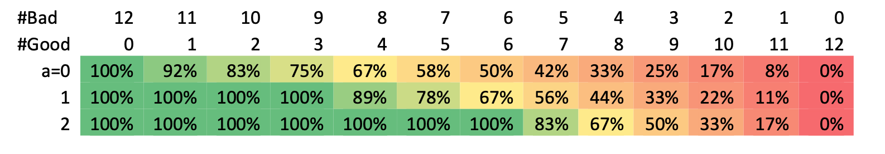
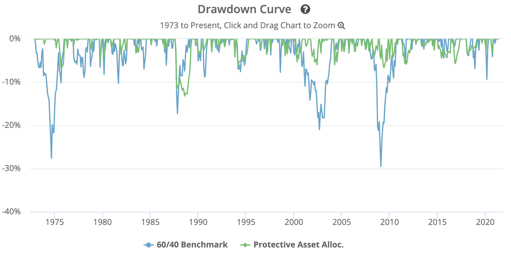

```{r setup, include=FALSE}
options(htmltools.dir.version = FALSE)
options(servr.daemon = TRUE)
# devtools::install_github("hadley/emo")
library(emo)
library(tidyverse)
library(stringr)
library(htmltools)
library(knitr)
library(tidyquant)
library(timetk)
library(PerformanceAnalytics)
library(xts)
library(data.table)
library(kableExtra)
library(gridExtra)
library(here)
library(xaringan)
```

```{r xaringan-themer, include=FALSE, warning=FALSE}
library(xaringanthemer)
style_duo_accent(
  primary_color = "#92A8D1",
  secondary_color = "#2A293E",
  inverse_header_color = "#5F9EA0",
  inverse_background_color = "#FFE4C4",
  inverse_text_color = "#000000"
)


```


# Introduction of the company

.pull-left[


]

.pull-right[

- **Data to information**

- **Information to insight**

- **Insight to implementation**

]


???
During this semester, I join the internship in Lynxx. The company is passionate about helping organizations across a range of industries solve the complex problems holding them back with the power of data at their fingertips to find the creative solutions. 
What they do is moving data to information, information to insight and finally insight to implementation. 
---
class: left, middle, inverse

# Protective Asset Allocation (PAA)

- ###“crash protection”

- ### protect the portfolio from excessive loss when just a handful of assets fail to show positive momentum. 

- ### test the model with 12 global random assets (2017-05-01 ~ 2021-04-01)

- ### satisfy our absolute return requirement + low risk
???
The model I will introduce today is the Protective Asset Allocation model. 
The strategy is notable for its aggressive use of a "crash protection" asset that has resulted in extremely low drawdowns relative to return, it will protect the portfolio from excessive loss when just a handful of assets fail to show positive momentum. 
We test the model with 12 global random assets starting within recent 4 years.
---
class: left, middle, inverse

## Relative momentum 
- assets with the highest relative returns (e.g. the Top6 assets out of a universe with 12 assets) are selected for investment

## Absolute momentum 
- a trend filter overlay (e.g.using Simple Moving Average SMA12) while replacing assets by cash when the trend is negative

## PAA
- a combination of absolute and relative momentum which were based on an SMA12 trend
- moving to cash for as long as the most recent price (P0) is below the SMA trend

???
the assets with the highest relative returns are selected for investment. This explains the relative momentum choosing the Top performing assets of the total assets.
absolute momentum often implies the application of a trend filter overlay (e.g.using Simple Moving Average) while replacing assets by cash when the trend is negative. 
Our momentum model is a combination of absolute and relative momentum which were based on the 12-month return, which can improve not only the risk but also the returns. 
---
class: left, middle, inverse

# Protective Momentum 
- moving all capital to “cash” like safe treasury bonds when global markets becomes more bearish
### Low protection strategy (PAA0), a=0
### Median protection strategy (PAA1), a=1
### High protection strategy (PAA2), a=2

???
In addition, we will use a protection by moving all capital to “cash” like safe treasury bonds when global markets becomes more bearish, which is called Protective Momentum. Therefore, we will combine protective momentum with simple momentum, based on SMA, to arrive at the PAA strategy. We will distinguish between low, medium and high protection strategies, depending on the chosen protection rate.
---
class: inverse
## 12 Assets in the universe N=12
```{r message=FALSE, echo=FALSE, warning=FALSE}
BEPTF <- read_csv(here::here("data/BEPTF.csv")) %>%
  select(Date, `Adj Close`) %>%
  rename(BEPTF = `Adj Close`)
DXCM <- read_csv(here::here("data/DXCM.csv")) %>%
  select(Date, `Adj Close`) %>%
  rename(DXCM = `Adj Close`)
FB <- read_csv(here::here("data/FB.csv")) %>%
  select(Date, `Adj Close`) %>%
  rename(FB = `Adj Close`)
FIVN <- read_csv(here::here("data/FIVN.csv")) %>%
  select(Date, `Adj Close`) %>%
  rename(FIVN = `Adj Close`)
FSLR <- read_csv(here::here("data/FSLR.csv")) %>%
  select(Date, `Adj Close`) %>%
  rename(FSLR = `Adj Close`)
FTV <- read_csv(here::here("data/FTV.csv")) %>%
  select(Date, `Adj Close`) %>%
  rename(FTV = `Adj Close`)
NFLX <- read_csv(here::here("data/NFLX.csv")) %>%
  select(Date, `Adj Close`) %>%
  rename(NFLX = `Adj Close`)
OSTK <- read_csv(here::here("data/OSTK.csv")) %>%
  select(Date, `Adj Close`) %>%
  rename(OSTK = `Adj Close`)
RUN <- read_csv(here::here("data/RUN.csv")) %>%
  select(Date, `Adj Close`) %>%
  rename(RUN = `Adj Close`)
SONY <- read_csv(here::here("data/SONY.csv")) %>%
  select(Date, `Adj Close`) %>%
  rename(SONY = `Adj Close`)
SWKS <- read_csv(here::here("data/SWKS.csv")) %>%
  select(Date, `Adj Close`) %>%
  rename(SWKS = `Adj Close`)
TXRH <- read_csv(here::here("data/TXRH.csv")) %>%
  select(Date, `Adj Close`) %>%
  rename(TXRH = `Adj Close`)

Portfolio <- BEPTF %>%
  left_join(DXCM, by = "Date") %>%
  left_join(FB, by = "Date") %>%
  left_join(FIVN, by = "Date") %>%
  left_join(FSLR, by = "Date") %>%
  left_join(FTV, by = "Date") %>%
  left_join(NFLX, by = "Date") %>%
  left_join(OSTK, by = "Date") %>%
  left_join(RUN, by = "Date") %>%
  left_join(SONY, by = "Date") %>%
  left_join(SWKS, by = "Date") %>%
  left_join(TXRH, by = "Date") %>%
  tail(-12) 
Portfolio
```

### "Limit your losses" - reduce risk, improve returns
???
Here is the 12 assets that we will use in our universe. All data is from free sources (Yahoo Finance), and consists of end-of-month dividend-adjusted prices. 
our protective momentum can be much more aggressive in moving to cash. This turns out to be not only good for risk reduction but even for returns. 
---
## **MOM(L) = p0/SMA(L) - 1**
.pull-left[
```{r message=FALSE, echo=FALSE}
P0 <- Portfolio %>%
  filter(Date == "2021-04-01") %>%
  pivot_longer(cols = c("BEPTF":"TXRH"),
               names_to = "Asset",
               values_to = "P0") %>%
  select(-Date) 
MOM <- Portfolio %>%
  filter(Date == c("2020-05-01", "2020-06-01","2020-07-01", "2020-08-01", "2020-09-01","2020-10-01","2020-11-01","2020-12-01","2021-01-01","2021-02-01","2021-03-01","2021-04-01")) %>%
  pivot_longer(cols = c("BEPTF":"TXRH"),
               names_to = "Asset",
               values_to = "Price") %>%
  group_by(Asset) %>%
  summarise(SMA12 = mean(Price)) %>%
  left_join(P0, by = "Asset") %>%
  mutate(MOM12 = P0/SMA12-1) %>%
  arrange(-MOM12)
kable(MOM, caption = "") %>%
  kable_styling(bootstrap_options = c("striped", "hover"))
```
]
.pull-right[
- **SMA** signals a positive trend when the latest price p0 is above the SMA(L) level.
- L=12 months
- n **good assets** with a positive momentum, MOM(L)>0, n<=N
- remaining (N-n) assets with MOM<=0 are the **bad assets**
- more bearish when n is low, more bullish when n is high relative to N 
- muti-market breadth indicator
- n = 9 while N = 12
]

???
our momentum indicator is based on the SMA(L) filter and the most recent asset price p0. The filter signals a positive trend when p0 is above the SMA level. Since we will be using monthly data as the table shown before, the lookback L always refers to L months.
Before disclosing the PAA recipe we have to define “good” and “bad” assets. There are n good assets with a positive momentum, The remaining assets with momentum lower than 0 are the bad assets.
From the table calculated, we could find that there are 9 good assets with positive momentum, and 3 bad assets with negative momentum in our 12 aasets universe. 
---
class: inverse
# Bond Fraction

The optimal **Bond Fraction (BF)** is determined by the market regime which is measured by the **multi-market breadth**.

BF will determine the balance between the risky and the bond part of our capital allocation, with monthly reformations. 

### **BF = (N-n)/(N-n1), with n1 = a*N/4** 
- where a is the protection factor (a>=0) and BF=100% if n<=n1.

???
The optimal mix of “risky” assets will be determined by the dual momentum model. The optimal Bond Fraction is determined by the market regime which is measured by the multi-market breadth. So BF will therefore determine the balance between the risky and the bond part of our capital allocation.
Therefore, we can compute the bond fraction depending on the number of good assets n as this equation where a is the protection factor. 
Notice that the higher the protection factor a is, the higher is n1 and therefore by increasing a, the bond fraction BF will become higher for the same number of good assets n. 
---
class: inverse
##  Recipe for PAA model
1. Compute the bond fraction BF depending on the number of good assets n: 
 
      **BF = (N-n)/(N-n1), with n1 = a*N/4** 
2. Determine the **Top (Top<=N) good assets** with the **highest momentum** to form the risky part of the portfolio with **equal weights (EW)** for each risky asset. 

   If n<Top, only the n good assets (with positive momentum) will be included in this risky Equal Weight (EW) portfolio.
3. Mix the risky EW portfolio with the bond part in a **(1-BF)/BF** fashion, like with the 60/40 strategy.

???
Having defined all necessary ingredients, we are now able to give the recipe for our PAA model:
Firstly, Compute the bond fraction depending on the number of good assets n with the equation, Then, Determine the Top good assets with the highest momentum to form the risky part of the portfolio with equal weights for each risky asset. 
Lastly, Mix the risky equal weight portfolio with the bond part in this fashion, like with the 60/40 strategy.
---
class: middle
## BF = (N-n)/(N-n1)
**BF as a function of a(0,1,2) vs number of good assets (n) and bad assets (N-n)**


.pull-left[
- a=0, BF=(N-n)/N, only when n=0, BF = 100%

- a=1, BF=(N-n)/(0.75N)， with 75% or more bad assets, BF = 100%
- a=2,  BF=(N- n)/(0.5N, with 50% or more bad assets, BF = 100%
]
.pull-right[
**In this case**

```{r message=FALSE, echo=FALSE, message=FALSE}
protection_factor <-c("a=0", "a=1", "a=2")
n1 <- c(0,3,6)
BF <- c("25.00%", "33.33%", "50.00%")
BF <- tibble(protection_factor, n1, BF)
kable(BF, caption = "Bond Fraction") %>%
  kable_styling(bootstrap_options = c("striped", "hover")) 
```
]
???
The low-protective PAA model arises when a=0. Only when all assets are bad, the bond fraction becomes 100%.
When the protection factor a=1, This  implies that with 75% or more bad assets in the universe, the bond fraction becomes 100%.
The most protective PAA model is obtained with a=2. This implies that with 50% or more bad assets in the universe, the bond fraction becomes 100%. 
In this case, the bond fraction soon becomes very dominant when the high-protective model is applied, where 9 (out of 12) good assets the bond coverage is already 50% as the table presented. Therefore we determine the Top good assets to form the risky part of the portfolio with equal weights for each risky asset for 50%.
---
class: inverse
## The best scenario based on top assets
**Return (R)**: The average monthly return earned by the portfolio over the period tested. 

**Volatility (V)**: Volatility is often measured as either the standard deviation or variance between returns from that same security or market index. The higher the volatility, the riskier the security.

**Max Drawdown (D)**: The worst loss ever suffered by the strategy, relative to a previous all time high. A value of -50% would mean that, at some point in the test, the strategy lost 50% of its value relative to its previous all time high.

**Sharpe Ratio (SR)**: A measure of a strategy’s historical return relative to volatility. Higher values are better than lower values. 

**MAR (R/D)**: A measurement of returns adjusted for risk that can be used to compare the performance of commodity trading advisors, hedge funds and trading strategies. The higher the ratio, the better the risk-adjusted returns. 

???
In order to compare the scenarios based on top assets, we will need performance measures. We will look at all the usual performance measures like return R, Volatility, D (max Drawdown), SR (Sharpe Ratio) and MAR ratio calculated by return divided by max drawdown. 
---
class: inverse
## The best scenario based on top assets
**1-year-rolling-return Win0**: We aim at a Win0 score of **at least 95%**, so out of all consecutive twelve months periods over the test period a maximum of only 5% may have a negative return and is therefore considered worse than a 1-year deposit.

**1-year-rolling-return Win5**:  We aim at a Win5 score of **at least 99%**, so that for a maximum of only 1% of the months the rolling 1-year return is below -5%. 

???
In addition, we will focus on the 1-year-rolling-return Win-rate 0 at least 95%, so out of twelve months periods, a maximum of only 5% may have a negative return.
To get a grip on the 1y-rolling negative returns, We aim at a Win5 score of at least 99%, so that for a maximum of only 1% of the months the rolling 1-year return is below -5%. We will use the term “absolute return strategy” when they satisfied. 
---
class: inverse
## The best scenario
To determine the best scenario, we will consider the following parameter values for our N=12 universe:
- L=12 months lookback
- a=2 highest protection level
- Top=4, 5, 6 (up to Top=6, so N/2)

```{r message=FALSE, echo=FALSE}
L <- c(12, 12, 12)
a <- c(2.0, 2.0, 2.0)
Top <- c(4, 5, 6)
R <- c("8.41%", "7.70%", "7.22%")
V <- c("9.93%", "9.14%", "8.84%")
D <- c("14.51%", "13.01%", "11.97%")
Win0 <- c("100.00%", "100.00%","100.00%")
Win5 <- c("100.00%", "100.00%","100.00%")
scenarios <- tibble(L, a, Top, R, V, D, Win0, Win5)
kable(scenarios, caption = "The best scenarios") %>%
  kable_styling(bootstrap_options = c("striped", "hover")) 
```
???
We will here allow for higher Top numbers (up to 6) .We will search over the scenarios and use the best scenario to be tested over the next stage.
Here I just show the table calculated, and the calculation process is in the report. Since the Top=6 scenario has the lowest volatility and drawdown, we choose this scenario as the best although the return is actually lowest. Since, we aim at absolute returns so protection and diversification overrules performance.
---
class: inverse
## Compare with other strategies
- **PAA1**: When a=1, BF=(N-n)/(0.75N), with a maximum of 100%. So with n=9 and N=12 in this case, the bond fraction becomes BF=33%

- **PAA0**: When a=0, BF=(N-n)/N. So with e.g. n=9 and N=12, the bond fraction becomes BF=25%.

- **Traditional 60/40**: As our benchmark we will use the traditional static 60/40 portfolio with SPY/IEF for stock/bond. It represents a 60% investment in SPY (S&P 500), 40% investment in IEF (intermediate-term US Treasuries), rebalanced monthly.

- **SPY**: It considers both economic data and trends in price to switch between US equities (SPY) and Treasuries (IEF).

???
now We will display the performance and compare with other strategies.  
As our benchmark we will use the traditional static 60/40 portfolio and also compared with SPY.
---
class: inverse, middle
## Comparison of performance
```{r echo=FALSE}
Strategy <- c("PAA2", "PAA1", "PAA0", "60/40", "SPY")
return <- c("7.22%", "6.46%", "6.11%", "1.23%", "1.78%")
Volatility <- c("8.84%", "8.80%", "8.89%", "3.20%", "5.80%")
Drawdown <- c("11.97%", "12.02%", "12.71%", "9.35%", "19.89%")
rateWin0 <- c("100.00%", "100.00%","100.00%","100.00%","100.00%")
rateWin5 <- c("100.00%", "100.00%","100.00%","100.00%","100.00%")
SR <- c("0.82", "0.73", "0.69", "0.38", "0.31")
MAR <- c("0.60", "0.54", "0.48", "0.13", "0.09")
Compare <- tibble(Strategy, return, Volatility, Drawdown, rateWin0, rateWin5, SR, MAR)
kable(Compare, caption = "") %>%
  kable_styling(bootstrap_options = c("striped", "hover")) 
```

???
The process of the calculation was presented in the report. Here, As shown in the table, the best return is the scenario when a = 2 which is the PAA2 model with 7.22%. We could find that all risk measures like Volatility, Max Drawdown are best for traditional 60/40, however the SR and MAR are extremely low. The volatility is best for PAA1 model within PAA family with 8.80% which is slightly lower than that of PAA2 model, but in terms of other measures, the performance of PAA2 model wins. 
Moreover, the sharp ratio and MAR of PAA2 is being two times the 60/40 SR and four times the 60/40 MAR. 
---
```{r message=FALSE, warning=FALSE, echo=FALSE, fig.width=10}
weights_t6 <- c(0.5/6, 0.5/6, 0.5/6, 0.5/6, 0.5/6, 0.5/6, 0.5/6, 0.5/6,0.5/6, 0.5/6, 0.5/6, 0.5/6)
Return <- Portfolio %>%
  pivot_longer(cols = c("BEPTF":"TXRH"),
               names_to = "Asset",
               values_to = "Price") %>%
  group_by(Asset) %>%
  tq_transmute(mutate_fun = periodReturn, period = "monthly") %>%
  spread(Asset, monthly.returns)
xts_rolling <- Return %>%
  tk_xts(date_col = Date)
rolling_t6 <- Return.portfolio(xts_rolling, weights = weights_t6)
SPY <- read_csv(here::here("data/SPY.csv")) %>%
  select(Date, `Adj Close`) %>%
  rename(SPY = `Adj Close`)
IEF <- read_csv(here::here("data/IEF.csv")) %>%
  select(Date, `Adj Close`) %>%
  rename(IEF = `Adj Close`)
Tradition6040 <- SPY %>%
  left_join(IEF, by = "Date") %>%
  tail(-12)
Return_6040 <- Tradition6040 %>%
  pivot_longer(cols = c("SPY","IEF"),
               names_to = "Asset",
               values_to = "Price") %>%
  group_by(Asset) %>%
  tq_transmute(mutate_fun = periodReturn, period = "monthly") %>%
  spread(Asset, monthly.returns)
weights_6040 <- c(0.4, 0.6)
xts_6040 <- Return_6040 %>%
  tail(-24) %>%
  tk_xts(date_col = Date)
return_6040 <- Return.portfolio(xts_6040, weights = weights_6040)
rolling_6040 <- Return_6040 %>%
  tk_xts(date_col = Date) %>%
  Return.portfolio(weights = weights_6040)
```

```{r monthly_return, warning=FALSE,fig.show = 'hide', echo=TRUE}
return_line <- merge(rolling_t6,rolling_6040, join='left')
colnames(return_line) <- c('PAA2','60/40')
charts.TimeSeries(return_line, date.format.in = "%Y-%m", legend.loc = "topleft", #<<
                  main = "Fig.1 Monthly return")
```
```{r ref.label = 'monthly_return', warning=FALSE,echo = FALSE, fig.width=10}
```

???
The figure 1 shows the performance of monthly returns within the last four years. As mentioned before, the overall return of PAA2 was higher than that of 60/40. In the most recent, the performance of PAA2 is lower, According to Keller and Keuning, this is the price we pay for an absolute-return strategy: better in bear markets, less in bull markets.
---
```{r message=FALSE, warning=FALSE,echo=FALSE}
a2return<- Return %>%
  tail(-24) %>%
  tk_xts(date_col = Date) %>%
  Return.portfolio(weights = weights_t6)
```
```{r Drawdowns, warning=FALSE, message=FALSE,fig.show = 'hide', echo=TRUE}
D_a2 <- Drawdowns(a2return)  #<<
D_6040 <- Drawdowns(return_6040) #<<
D_line <- merge(D_a2,D_6040, join='left')
colnames(D_line) <- c('PAA2','60/40')
charts.TimeSeries(D_line, date.format.in = "%Y-%m", legend.loc = "bottomright", main = "Fig.2 Drawdown") #<<
```
```{r ref.label = 'Drawdowns', warning=FALSE,echo = FALSE, fig.width=10, fig.height=6}
```

???
The figure 2 focus on drawdowns, where the larger drawdowns of the PAA2 strategy contrast with that of the 60/40 benchmark within the recent two years. Since we only focus on the recent years, it might not that representative, therefore we could see this chart from keller. 
---
class: middle
### Drawdowns of PAA2 and 60/40 since 1973

???
This is the drawdown curve in a longrun from 1973 to present. we could find the large nealry 30% drawdowns of the 60/40 benchmark contrast sharply with the constrained drawdowns of the PAA strategy. But to see the impact over say one year, we needs to look at the rolling returns.
---
### Rolling 1y and 3y return
```{r echo=FALSE, message=FALSE, warning=FALSE, fig.height=3.5, fig.width=10}
rolling_return_t6 <- rolling_t6 %>%
  apply.rolling(width = 37) 
rolling_return_6040 <- rolling_6040 %>%
  apply.rolling(width = 37) %>%
  tail(-36)
rolling_1y <- merge(rolling_return_t6,rolling_return_6040, join='left') %>%
  tail(-36)
colnames(rolling_1y) <- c('1y PAA2','1y 60/40')
charts.TimeSeries(rolling_1y, date.format.in = "%Y-%m",
                    legend.loc = "center",
                  main = "Fig.4 Rolling-1y return")
```
```{r echo=FALSE, message=FALSE, warning=FALSE, fig.height=3.5, fig.width=10}
rolling3_t6 <- rolling_t6 %>%
  apply.rolling(width = 13)
rolling3_6040 <- rolling_6040 %>%
  apply.rolling(width = 13)
rolling_3y <- merge(rolling3_t6,rolling3_6040, join='left') %>%
  tail(-12)
colnames(rolling_3y) <- c('3y PAA2','3y 60/40')
charts.TimeSeries(rolling_3y, date.format.in = "%Y-%m",
                    legend.loc = "center",
                  main = "Fig.5 Rolling-3y return")
```
???
It is clear that the average return of PAA2 is always higher when it becomes to both 1y and 3y rolling return.
---
class: inverse
# Conclusion
Protective Asset Allocation: dual-momentum model combined with crash protection results in a higher return and much lower risk. 

Applying a simple market-regime indicator based on the number of positive trending assets (the “multi- market breadth”) to our risky universe, using SPY as safe bond, the resulting high-protective PAA2 strategy achieves the mentioned absolute-return targets, in contrast to the 60/40 benchmark. 

The fixed 60/40 stock/bond benchmark makes a monthly return of 1.23% with a max drawdown of 9.35%, while SPY makes a monthly return of 1.78% with a max drawdown of 19.89%, therefore the SR and MAR are extremely low for them.

We will conclude that risk is severely reduced basing on PAA2 protective model while return is even better than 60/40, resulting in better Sharpe ratios, which means it satisfies our absolute return requirement without compromising high returns with low risks at the same time, a primary advantage of this strategy historically has been in managing losses.
???
During my project, what we do is applying a simple market-regime indicator based on the number of positive trending assets to our risky universe, using SPY as safe bond, the resulting high-protective PAA2 strategy achieves the mentioned absolute-return targets, in contrast to the 60/40 benchmark. a primary advantage of this strategy historically has been in managing losses.
---
class: inverse
# References & Reflection
Faber, M. T. 2007. “A Quantitative Approach to Tactical Asset Allocation.” *Wealth Management*.

Hurst, B., Y.H. Ooi, and L.H. Pedersen, 2012, A Century of Evidence on Trend-Following Investing, working paper, *AQR Capital Management*.

Keller, Wouter J., and Jan Willem Keuning. 2016. “Protective Asset Allocation (PAA): A Simple Momentum-Based Alternative for Term Deposits.” *SSRN*. https://ssrn.com/abstract=2759734 or http://dx.doi.org/10.2139/ssrn.2759734.

???
I really feel meaningful of this project working with Matt, and he is quite patient that I can pose questions and learn a lot since I did't have much background of this things. Moreover, I used a new package called library(PerformanceAnalytics) that I didnt know before, we can use this package to simply analyze the performance and calculate risks, and get the graph we need, which is more convent compared to using excel. 
---
class: center, middle, inverse

# Thanks for your time `r emo::ji("favor")`
